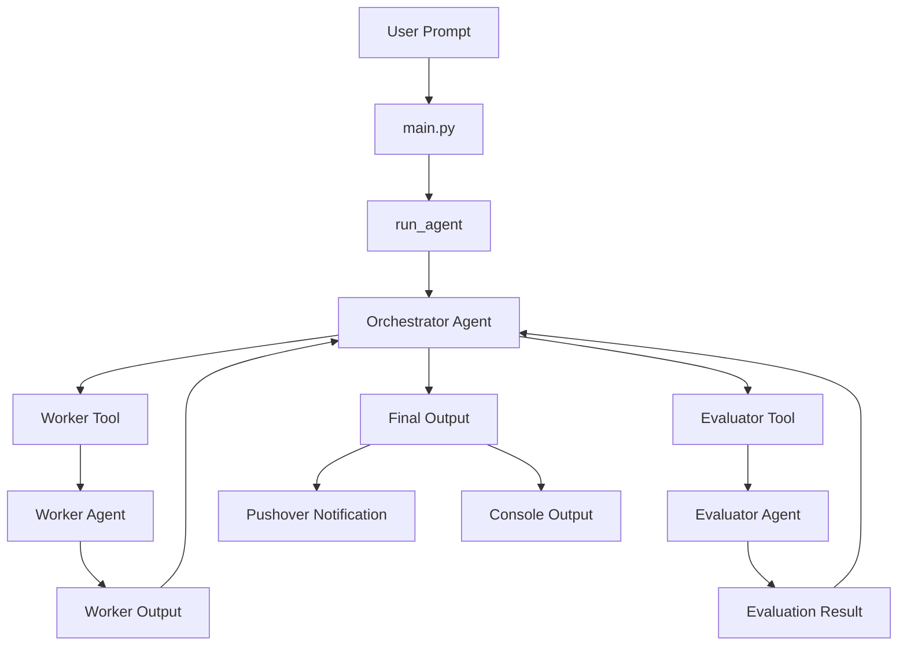

# OpenAgent

OpenAgent is a Python multi-agent assistant built with the OpenAI Agents SDK. It uses an orchestrator agent to break down a user request, a worker agent to complete delegated work, an evaluator agent to review outputs, and Pushover to send the final result to your phone.

## What It Can Do

OpenAgent can take a natural-language task, plan how it should be handled, delegate the work to a worker agent, review the result, and return a final response. It is designed as a simple multi-agent workflow rather than a single assistant doing everything directly.

The agent is capable of:

- Breaking a user request into smaller subtasks.
- Delegating work from an orchestrator agent to a worker agent.
- Running an evaluator agent to check the quality of generated output.
- Combining agent outputs into a final response.
- Sending the final result to your phone using Pushover.
- Exposing the Pushover sender as an agent tool when an agent needs to call it directly.
- Running from a Python script or being adapted into notebooks and other Python workflows.

Current example use case:

```python
result = await run_agent(
    "tell me about max verstappen and send the data to my phone"
)
```

In this flow, the orchestrator receives the request, delegates the research or writing task, collects the result, and then `run_agent()` sends the final output as a push notification.

## Architecture Diagram



## Project Structure

```text
OpenAgent/
├── main.py                 # Example entry point for running the agent
├── src/
│   ├── agent.py            # Agent setup, model client config, tools, and run_agent()
│   ├── prompt.py           # Instruction templates for orchestrator, evaluator, and worker agents
│   └── tools/
│       └── pushover.py     # Pushover notification helper and agent tool wrapper
├── multiagents.ipynb       # Notebook version of the multi-agent experiment
├── pyproject.toml          # Project metadata and Python dependencies
├── uv.lock                 # Locked dependency versions for uv
├── requirements.txt        # Empty placeholder; dependencies are currently in pyproject.toml
├── .python-version         # Python version file
└── README.md
```

### Key Files

`src/agent.py` defines the main agents:

- `orchestrator_agent`: plans the task and delegates work.
- `worker_agent`: performs assigned subtasks.
- `evaluator_agent`: reviews outputs.
- `run_agent(prompt, notify=True)`: runs the orchestrator and optionally sends the final output through Pushover.

`src/tools/pushover.py` contains:

- `send_push_notification(message)`: sends a direct Pushover notification.
- `push(message)`: exposes Pushover as an Agents SDK function tool.

`main.py` shows a minimal example of calling `run_agent()`.

## Installation

### 1. Clone the repository

```bash
git clone <your-repo-url>
cd OpenAgent
```

### 2. Install Python

This project requires Python 3.11 or newer.

```bash
python --version
```

### 3. Install dependencies

The project is configured for `uv`.

```bash
uv sync
```

If you prefer using `pip`, create a virtual environment and install the dependencies from `pyproject.toml`:

```bash
python -m venv .venv
source .venv/bin/activate
pip install agents dotenv openai openai-agents pydantic requests
```

### 4. Configure environment variables

Create a `.env` file in the project root:

```bash
DEEPSEEK_API_KEY=your_deepseek_api_key
PUSHOVER_USER=your_pushover_user_key
PUSHOVER_TOKEN=your_pushover_app_token
```

`DEEPSEEK_API_KEY` is used by the configured DeepSeek model client. `PUSHOVER_USER` and `PUSHOVER_TOKEN` are required if `notify=True`.

### 5. Run the project

```bash
python main.py
```

By default, `run_agent()` sends the final output to Pushover:

```python
result = await run_agent("tell me about max verstappen and send the data to my phone")
```

To run without sending a phone notification:

```python
result = await run_agent("tell me about max verstappen", notify=False)
```

## Notes

- Do not commit `.env` or API keys to GitHub.
- The Pushover notification is sent after the full agent run completes, so delivery does not depend on the worker agent choosing to call the notification tool.
- If Pushover credentials are missing or invalid, the notification helper raises an error instead of silently failing.
